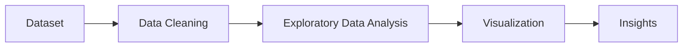

# Loan Approval Analysis

This project analyzes loan approval data using Python and data analysis libraries like Pandas, NumPy, Matplotlib, and Seaborn.

The main goal of this project is to understand loan approval patterns through data cleaning, exploratory data analysis (EDA), and visualization.

---

## Project Workflow



---

## Features

- Data Cleaning
- Handling Missing Values
- Exploratory Data Analysis (EDA)
- Data Visualization
- Loan Approval Insights

---

## Technologies Used

- Python
- Pandas
- NumPy
- Matplotlib
- Seaborn

---

## Project Structure

```text
Loan-Approval-Analysis/
│
├── loananalysis.py
├── loan_data.csv
├── README.md
└── graph.png
```

---

## Installation

Install the required libraries using:

```bash
pip install pandas numpy matplotlib seaborn
```

---

## How to Run

Run the Python file using:

```bash
python loananalysis.py
```

---

## Visualization

Add your graph screenshot inside the project folder and name it:

```text
graph.png
```

Then it will appear below automatically:


---

## Sample Insights

- Compared approved vs rejected loans
- Visualized loan approval distribution
- Explored dataset structure and missing values

---

## Future Improvements

- Add Machine Learning model
- Use larger real-world datasets
- Create dashboard using Power BI
- Improve visualizations

---

## Author

Suyashri Tavate
```
